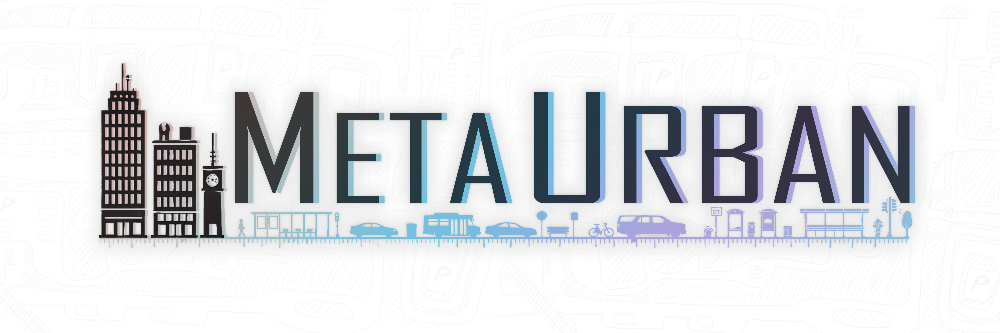

# MetaUrban: An Embodied AI Simulation Platform for Urban Micromobility

[](https://arxiv.org/pdf/2407.08725.pdf)
[](https://metaurban-simulator.readthedocs.io)
[](https://github.com/metadriverse/metaurban/blob/main/LICENSE.txt)
[](https://github.com/metadriverse/metaurban/graphs/contributors)

<div style="text-align: center; width:100%; margin: 0 auto; display: inline-block">
<strong>
[
<a href="https://metaurban-simulator.readthedocs.io">Documentation</a>
|
<a href="https://colab.research.google.com/github/metadriverse/metaurban/blob/main/metaurban/examples/basic_colab_usage.ipynb">Colab Examples</a>
|
<a href="https://metadriverse.github.io/metaurban/">Website</a>
|
<a href="https://arxiv.org/pdf/2407.08725.pdf">Paper</a>
|
<a href="https://metadriverse.github.io/">Relevant Projects</a>
]
</strong>
</div>


**`MetaUrban`** is a cutting-edge simulation platform designed for Embodied AI research in urban spaces. It offers:

- 🌆 **Infinite Urban Scene Generation**: Create diverse, interactive city environments.  
- 🏗️ **High-Quality Urban Objects**: Includes real-world infrastructure and clutter.   
- 🧍 **Rigged Human Models**: SMPL-compatible models with diverse motions.
- 🤖 **Urban Agents**: Including delivery robots, cyclists, skateboarders, and more.  
- 🕹️ **Flexible User Interfaces**: Compatible with mouse, keyboard, joystick, and racing wheel.  
- 🎥 **Configurable Sensors**: Supports RGB, depth, semantic map, and LiDAR.  
- ⚙️ **Rigid-Body Physics**: Realistic mechanics for agents and environments.  
- 🌍 **OpenAI Gym Interface**: Seamless integration for AI and reinforcement learning tasks.
- 🔗 **Framework Compatibility**: Seamlessly integrates with Ray, Stable Baselines, Torch, Imitation, etc.

📖 Check out [**`MetaUrban` Documentation**](https://metaurban-simulator.readthedocs.io) to learn more!

<p align="center">
  

</p>


## Latest Updates
- [24/01/25] **v0.1.0**: The first official release of MetaUrban :wrench: [[release notes]](https://github.com/metadriverse/metaurban/releases/tag/v0.1.0)


## Table of Contents

- [MetaUrban](#metaurban-an-embodied-ai-simulation-platform-for-urban-micromobility)
  - [📎 Citation](#-citation)
  - [🛠 Quick Start](#-quick-start)
    - [Hardware Recommendations](#hardware-recommendations)
    - [Installation](#installation)
    - [Docker Setup](#docker-setup)
  - [🏃‍♂️ Simulation Environment Roam](#️-simulation-environment-roam)
    - [Point Navigation Environment](#point-navigation-environment)
    - [Social Navigation Environment](#social-navigation-environment)
  - [🤖 Run a Pre-Trained (PPO) Model](#-run-a-pre-trained-ppo-model)
  - [🚀 Model Training and Evaluation](#-model-training-and-evaluation)
    - [Reinforcement Learning](#reinforcement-learning)
      - [Training](#training)
      - [Evaluation](#evaluation)
    - [Imitation Learning](#imitation-learning)
      - [Data collection](#data-collection)
      - [Training](#training)
  - [📖 Questions and Support](#questions-and-support)
  

## 📎 Citation

If you find MetaUrban helpful for your research, please cite the following BibTeX entry.

```latex
@article{wu2025metaurban,
  title={MetaUrban: An Embodied AI Simulation Platform for Urban Micromobility},
  author={Wu, Wayne and He, Honglin and He, Jack and Wang, Yiran and Duan, Chenda and Liu, Zhizheng and Li, Quanyi and Zhou, Bolei},
  journal={ICLR},
  year={2025}
}
```

## 🛠 Quick Start

### Hardware Recommendations

To ensure the best experience with **MetaUrban**, please review the following hardware guidelines:

- **Tested Platforms**:  
  - **Linux**: Supported and Recommended (preferably Ubuntu).
  - **Windows**: Works with **WSL2**.  
  - **MacOS**: Supported.  

- **Recommended Hardware**:  
  - **GPU**: Nvidia GPU with at least **8GB RAM** and **3GB VRAM**.  
  - **Storage**: Minimum of **10GB free space**.  

- **Performance Benchmarks**:  
  - Tested GPUs: **Nvidia RTX-3090, RTX-4080, RTX-4090, RTX-A5000, Tesla V100**.  
  - Example benchmark:  
    - Running `metaurban/examples/drive_in_static_env.py` achieves:  
      - ~**60 FPS**  
      - ~**2GB GPU memory usage**


### One-step Installation

```bash
git clone -b main --depth 1 https://github.com/metadriverse/metaurban.git
cd metaurban
bash install.sh
conda activate metaurban
```

### Step-by-step Installation
If not installed successfully by running `install.sh`, try step-by-step installation.

Create conda environment and install metaurban
```bash
conda create -n metaurban python=3.9
conda activate metaurban
pip install -e .
```

Install ORCA algorithm for trajectory generation

```bash
conda install pybind11 -c conda-forge
cd metaurban/orca_algo && rm -rf build
bash compile.sh && cd ../..
```

It should be noticed that you should install ```cmake,make,gcc``` on your system before installing ORCA, more details can be found in [FAQs](documentation/FAQs.md).

Then install the following libs to use MetaUrban for RL training and testing.

```bash
pip install stable_baselines3 imitation tensorboard wandb scikit-image pyyaml gdown
```

### Quick Run
We provide a script to quickly run our simulator with a tiny subset of 3D assets. The assets (~500mb) will be downloaded automatically the first time you run the script:

```bash
python metaurban/examples/tiny_example.py
```

### User Registration
In order to access the entire dataset and use the complete version, please fill out a form to register through [registration link](https://forms.office.com/r/tFBRFk7u4E). This process will be triggered automatically when you attempt to pull the full set of assets.


### Assets
**The assets are compressed and password-protected. You’ll be prompted to fill out a registration form the first time you run the script to download all assets. You’ll receive the password once the form is completed.**

Assets will be downloaded automatically when first running the script 

```bash
python metaurban/examples/drive_in_static_env.py
```

Or use the script

```bash
python metaurban/pull_asset.py --update
```

If you cannot download assets by Python scripts, please download assets via the link in the Python file and organize the folder as:

```
-metaurban
  -metaurban
      -assets
      -assets_pedestrian
      -base_class
      -...
```

### Docker Setup
We provide a docker file for MetaUrban. This works on machines with an NVIDIA GPU. To set up the MetaUrban using docker, follow the below steps:
```bash
[sudo] docker -D build -t metaurban .
[sudo] docker run -it metaurban
cd metaurban/orca_algo && rm -rf build
bash compile.sh && cd ../.. 
```

Then you can run the simulator in docker.

## 🏃‍♂️ Simulation Environment Roam
We provide examples to demonstrate features and basic usages of metaurban after the local installation.

### Point Navigation Environment

In a point navigation environment, there will be only static objects besides the ego agent in the scenario.

Run the following command to launch a simple scenario with manual control. Press `W,S,A,D` to control the delivery robot. 


```bash
python -m metaurban.examples.drive_in_static_env 
--density_obj 0.4
```

Press the key ```R``` to load a new scenario. If there is no response when you press `W,S,A,D`, press `T` to enable manual control.

### Social Navigation Environment
In a social navigation environment, there will be vehicles, pedestrians, and some other agents in the scenario.

Run the following command to launch a simple scenario with manual control. Press `W,S,A,D` to control the delivery robot. 

```bash
python -m metaurban.examples.drive_in_dynamic_env
--density_obj 0.4 --density_ped 1.0
```
## 🤖 Run a Pre-Trained (PPO) Model 

We provide RL models trained on the task of navigation, which can be used to preview the performance of RL agents.

```bash
python -m metaurban.examples.drive_with_pretrained_policy
```

## 🚀 Model Training and Evaluation

### Reinforcement Learning
#### Training
```bash
python RL/PointNav/train_ppo.py
```
For PPO training in PointNav Env. You can change the parameters in the file.

```bash
python RL/SocialNav/train_ppo.py
```
For PPO training in Social Env. You can change the parameters in the file.

#### We only test training on Linux, there may be some issues on Windows and MacOS.

#### Evaluation
We provide a script used to evaluate the quantitative performance of the RL agent
```bash
python RL/PointNav/eval_ppo.py --policy ./pretrained_policy_576k.zip
```
As an example of evaluating the provided policy.

### Imitation Learning
#### Data collection
```bash
python scripts/collect_data_in_custom_env.py
```
For expert data collection used in IL. You can change the parameters in the file `custom_metaurban_env.yaml` to modify the environment.

#### Training
```bash
python IL/PointNav/train_BC.py
```
For behavior cloning, you should change the path of the `expert_data_path`.

```bash
python IL/PointNav/train_GAIL.py
```
For GAIL, you should change the path of the `expert_data_path`.

## 📖 Questions and supports

For frequently asked questions about installing, RL training and other modules, please refer to: [FAQs](documentation/FAQs.md)

Can't find the answer to your question? Try asking the developers and community on our Discussions forum.

## 💘 Acknowledgement
The simulator can not be built without the help from Panda3D community and the following open-sourced projects:
- panda3d-simplepbr: https://github.com/Moguri/panda3d-simplepbr
- panda3d-gltf: https://github.com/Moguri/panda3d-gltf
- RenderPipeline (RP): https://github.com/tobspr/RenderPipeline
- Water effect for RP: https://github.com/kergalym/RenderPipeline 
- procedural_panda3d_model_primitives: https://github.com/Epihaius/procedural_panda3d_model_primitives
- DiamondSquare for terrain generation: https://github.com/buckinha/DiamondSquare
- KITSUNETSUKI-Asset-Tools: https://github.com/kitsune-ONE-team/KITSUNETSUKI-Asset-Tools
- Objaverse: https://github.com/allenai/objaverse-xl
- OmniObject3D: https://github.com/omniobject3d/OmniObject3D
- Synbody: https://github.com/SynBody/SynBody
- BEDLAM: https://github.com/pixelite1201/BEDLAM
- ORCA: https://gamma.cs.unc.edu/ORCA/
