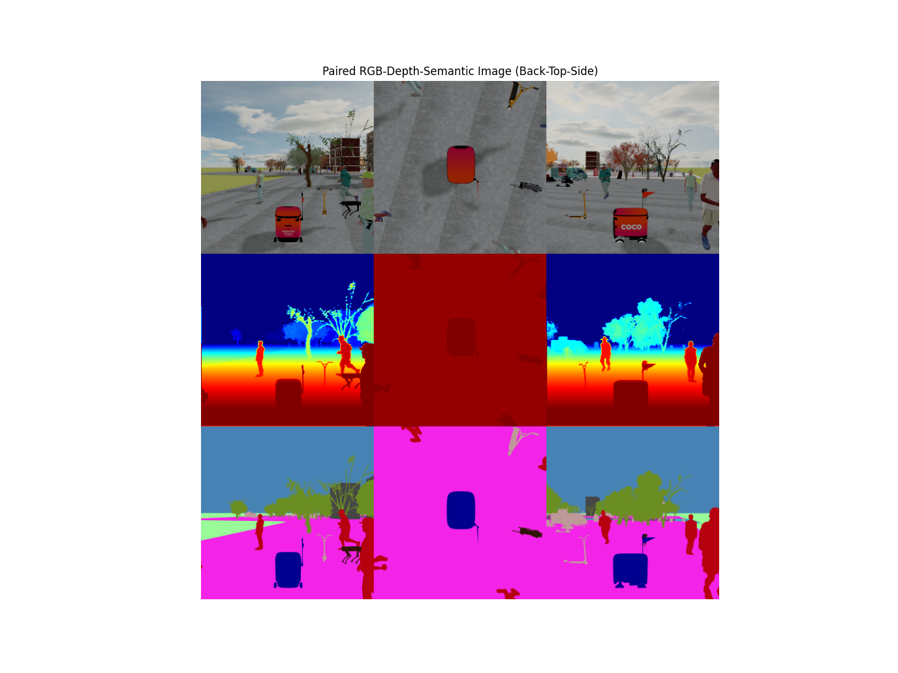

# FAQs in MetaUrban

## 🛠 Installation

### Windows and Linux

There may be some issues when installing ORCA on Windows that cannot be easily resolved. We highly recommend conducting experiments on WSL2, which has undergone more thorough verIfication.

The installation of MetaUrban requires the following tools:

```bash
make, cmake, gcc
```

Please check the installation of these tools via

```bash
make -v
cmake --version
gcc -v
```

If not installed, use commands on WSL2 and Linux
```bash
sudo apt-get update
sudo apt-get install make cmake gcc
```

### MacOS
Please check the installation of these tools via

```bash
make -v
cmake --version
gcc -v
```

If not installed, use commands on MacOS
```bash
sudo brew install make cmake gcc
```

If there is no brew on your PC, use
```bash
/bin/bash -c "$(curl -fsSL https://raw.githubusercontent.com/Homebrew/install/HEAD/install.sh)"

nano ~/.zshrc
export PATH="/opt/homebrew/bin:$PATH"
source ~/.zshrc
```
to install brew

Additionally, we highly recommend that use bash via
```bash
bash
```

### General

If you meet issues about path like
```bash
no 'bind' (in /PATH/TO/METAURBAN/metaurban/policy/orca_planner.py)
```

Try
```bash
export METAURBANHOME='/PATH/TO/METAURBAN'
```

## 💡 Rendering

### Headless mode
If your PC is without monitor, you can only use offscreen rendering mode by setting
```bash
use_render=False,
manual_control=False,
```

and add some specIfic lines in scripts to warm up the environment
```bash
from metaurban.envs.base_env import BASE_DEFAULT_CONFIG
from metaurban.engine.engine_utils import initialize_engine, close_engine
config_warmup = BASE_DEFAULT_CONFIG.copy()
config_warmup["debug"] = True
initialize_engine(config_warmup)
close_engine()
```
before spawning environment
```bash
env = SidewalkStaticMetaUrbanEnv(config)
o, _ = env.reset(seed=0)
```

### Rendering pattern
There may be some minor dIfference of rendering qualities among dIfferent systems, which is normal.

### Testing rendering results
You can test the cameras via
```bash
metaurban/tests/latest_updated/test_semantic_camera_synbody.py
```
If everything functions properly, you should observe paired images like the example below


## 🚀 RL training
If you plan to train RL agents on your PC, make sure to adjust the number of environments in the scripts:
```bash
n_envs=20
```
This will help prevent out-of-memory (OOM) errors or high CPU usage. However, due to the inherent characteristics of RL, setting the number of environments too low may compromise the effectiveness of agent training.

## 🤖 Run a Pre-Trained (PPO) Model 

We provide RL models trained on the task of navigation, which can be used to preview the performance of RL agents.

```bash
python -m metaurban.examples.drive_with_pretrained_policy
```

and the target result would be

